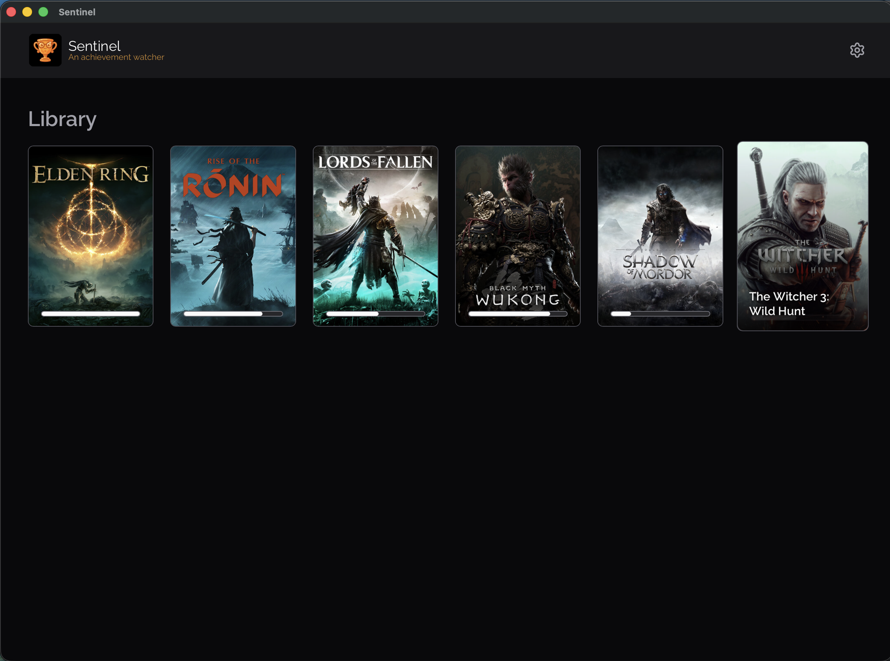
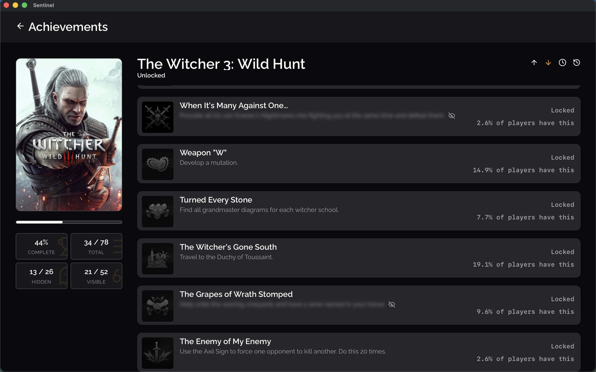
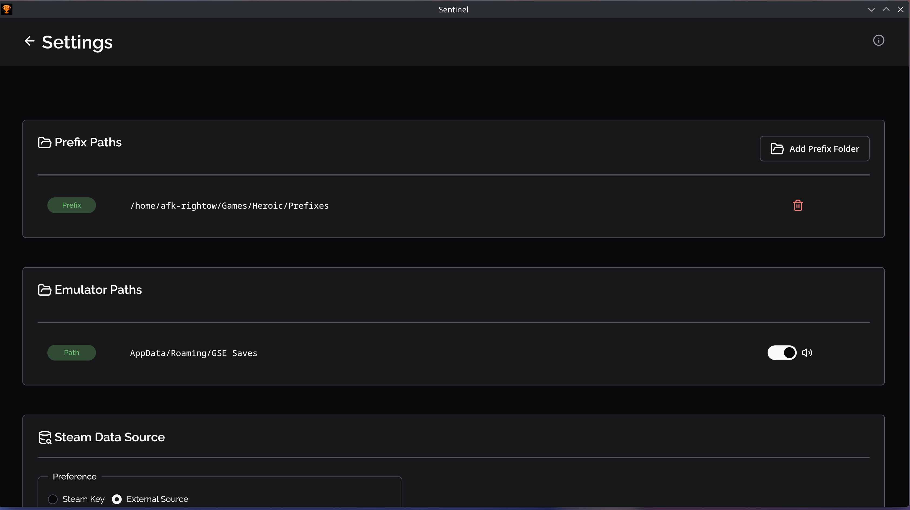

# Sentinel


**An achievement watcher for Steam emulator games on Linux**

Sentinel monitors your Steam emulator save files and sends real-time desktop notifications when achievements are unlocked or progress is updated. It also serves as a library viewer with completion stats, global achievement percentages, and more.

---

## Features

- Real-time desktop notifications
- Progress tracking for multi-step achievements
- Game library with completion stats and sorting
- Global achievement percentages from [Steam API](https://steamcommunity.com/dev)
- Custom notification sounds (10 platform-themed options)
- System tray support (runs in background)
- Choice of [Steam Web API key](https://steamcommunity.com/dev/apikey) or free external data source ([SteamHunters](https://steamhunters.com))

## Screenshots


*Game library with completion progress*


*Achievement list with global percentages*


*Desktop notification with achievement icon*


*Configuration panel*

## Installation

### Linux Packages

Download the latest release from [GitHub Releases](https://github.com/RemakeCode/sentinel/releases).

**Debian/Ubuntu (.deb):**
```bash
sudo dpkg -i sentinel_<version>_amd64.deb
```

**Fedora/RHEL (.rpm):**
```bash
sudo dnf install sentinel-<version>.x86_64.rpm
```

**Arch Linux:**
```bash
sudo pacman -U sentinel-<version>-x86_64.pkg.tar.zst
```

### System Requirements

- **GTK 4** ([libgtk-4-1](https://www.gtk.org/))
- **WebKitGTK 6.0** ([libwebkitgtk-6.0-4](https://webkitgtk.org/))
- **libnotify** ([libnotify-bin](https://gitlab.gnome.org/GNOME/libnotify))


## Quick Start

1. **Configure Prefix Paths** — Add your Wine/Proton prefix directories where emulated games are installed
2. **Configure Emulator Paths** — Add paths to emulator save directories (default: `AppData/Roaming/GSE Saves`)
3. **Choose Data Source** — Use a [Steam API key](https://steamcommunity.com/dev/apikey) for faster data, or the free external source

Sentinel will automatically scan for games and watch for achievement changes as long as it is running in the system tray.

## Configuration

Config file location: `~/.cache/sentinel/config.json`

## FAQ

### What emulators are supported?
Any emulator that writes `achievements.json` files in a `GSE Saves` directory structure. This includes [Goldberg Steam Emulator](https://github.com/Detanup01/gbe_fork)


### Do I need a Steam API key?
No. Sentinel defaults to using [SteamHunters](https://steamhunters.com) and Steam Community pages as a free data source. A [Steam Web API key](https://steamcommunity.com/dev/apikey) is advisable and provides faster, more reliable data.

### Why aren't notifications showing?
- Ensure you have `lib-notify` installed. Running `notify-send` shouldn't return `command`
- Check that your desktop environment supports D-Bus notifications
- Verify Notifications are enabled for your prefix paths in Settings

### Can I use this on Windows or macOS?
Short answer - No. Sentinel is Linux-first. It is technically possible to have a Windows build, where is the fun in that 

### How do I add a new game after setup?
Sentinel automatically rescans prefix directories every few seconds. New games appear in the library automatically.

### Is there a plan to support SteamDeck AKA running in Gamescope
Yes.

## Acknowledgments

- [Wails v3](https://wails.io/) — Desktop app framework
- [React](https://react.dev/) — Frontend
- [Oat UI](https://oat.ink/)
- [fsnotify](https://github.com/fsnotify/fsnotify) — File system watcher
- [Goldberg Emulator](https://github.com/Detanup01/gbe_fork) — Inspiration and compatibility

## License

[MIT](LICENSE)

## Legal
⚠️ Software provided here is purely for informational purposes and does not provide nor encourage illegal access to copyrighted material.

This software is provided "as is" without warranty of any kind. The authors accept no liability for any damages or issues arising from its use.

This project is not affiliated with, endorsed by, or associated with Valve Corporation, Steam, or any other trademark owners. Achievement data is fetched from publicly available Steam APIs and third-party sources.

All trademarks mentioned are the property of their respective owners.
