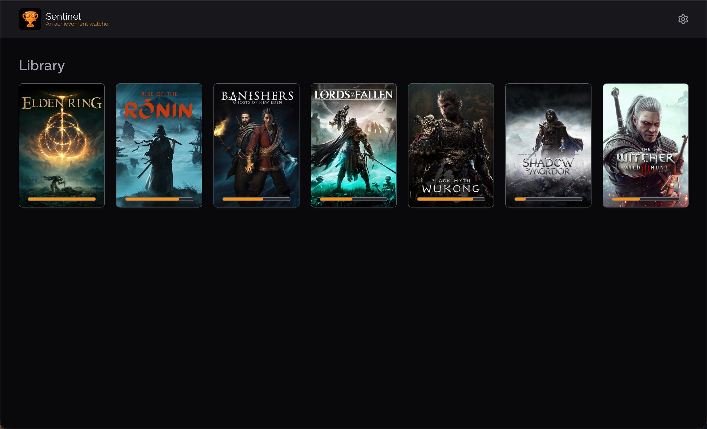
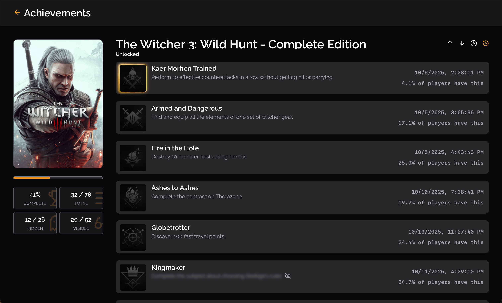
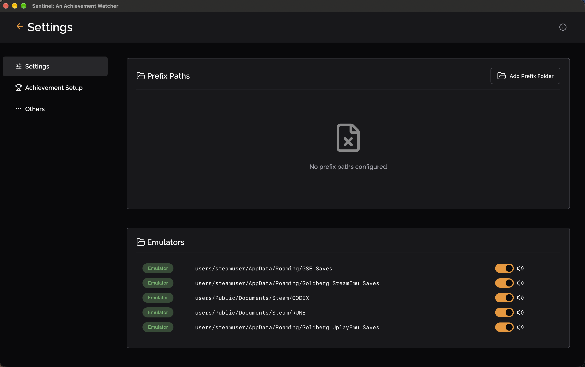
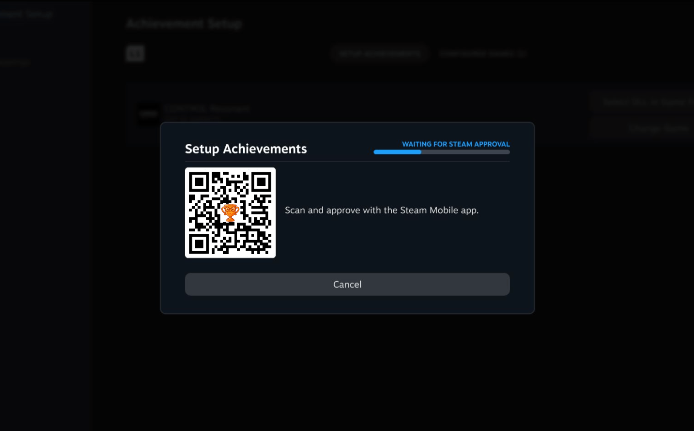
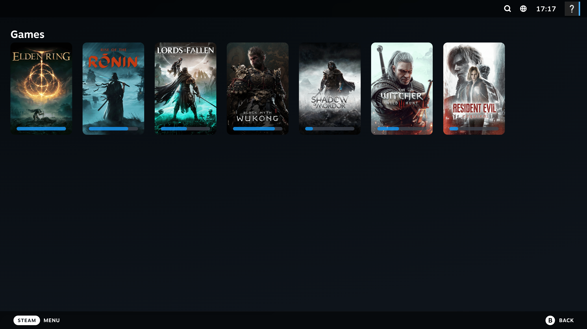
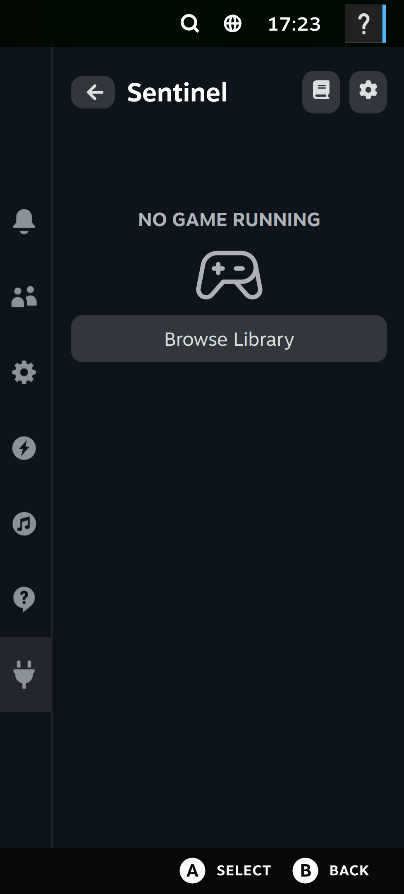
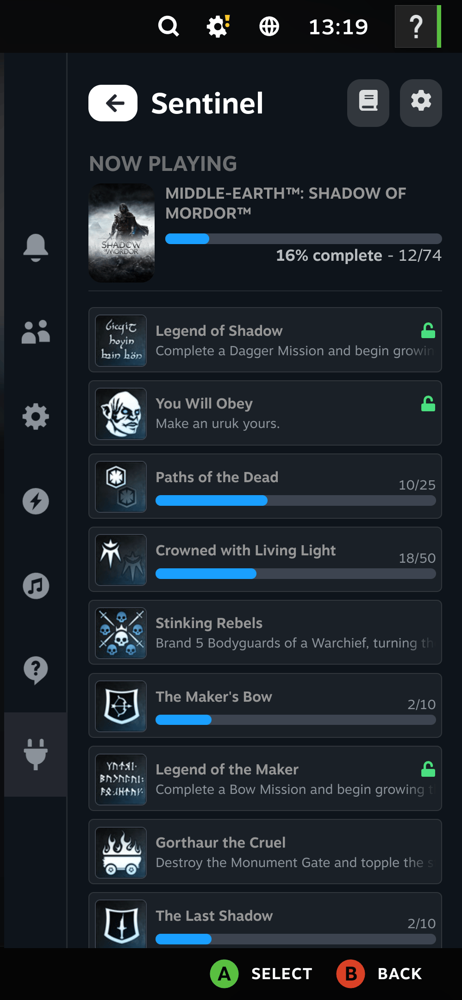
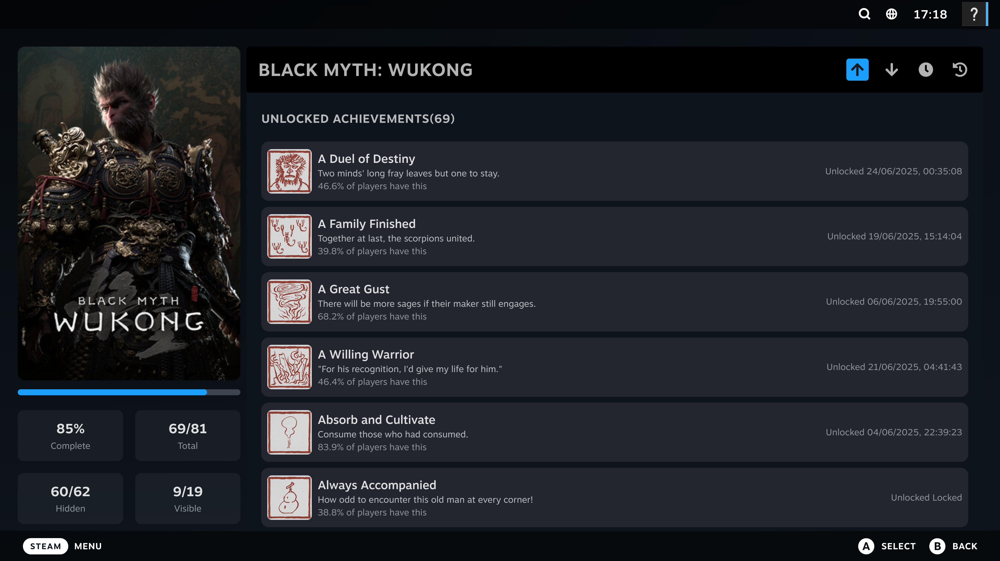
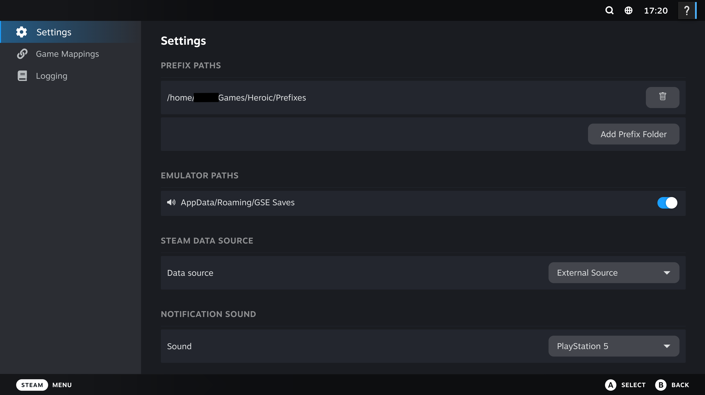
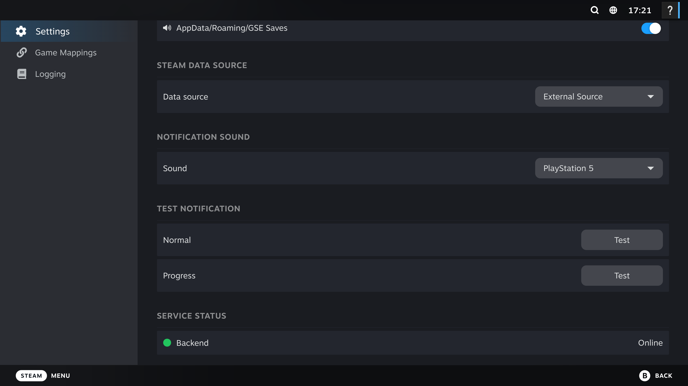

# Sentinel - Achievement Watcher for Linux

An achievement watcher for supported Steam emulator games, with real-time notifications and Decky Loader support for Gamescope-based Steam Gaming Mode/Session.

---

## Features

- Real-time desktop notifications
- Achievement progress notifications and multi-step progress tracking
- Game library with completion stats, sorting, and per-game data refresh
- Support for Goldberg/GSE, CODEX, RUNE, and Goldberg Uplay R2 achievement data
- Global achievement details from Steam and external community sources
- Custom notification sounds
- Optional best effort achievement setup using Goldberg fork and tools
- Decky Loader support for Gamescope-based Steam Gaming Mode, including Steam Deck

## Screenshots

### In Game


*WB Games - Middle Earth: Shadow of Mordor*

### Dashboard


### Achievement Details



### Settings


### Achievement Setup


*Approve achievement setup with the Steam Mobile app.*

## Installation

### System Requirements (native packages)
- **GTK 4** (`libgtk-4-1`)
- **WebKitGTK 6** (`libwebkitgtk-6.0-4`)


### Linux Packages

Download the package for your distribution, or the Flatpak, from [GitHub Releases](https://github.com/RemakeCode/sentinel/releases). Install it using your usual method.

### Decky Loader and Steam Gaming Mode

The Sentinel Decky Loader plugin brings achievement tracking into Gamescope-based Steam Gaming Mode and shares features, configuration and data with the Linux desktop app. It works on Steam Deck and other Linux systems running Decky Loader on a Steam Session in Gamescope.

Decky-only features include:

- **Now Playing** gives quick access to all achievements for the game currently being played.
- **Optional SteamGridDB** artwork for the library (requires the SteamGridDB Decky plugin).

#### Decky screenshots

**Library**



**No game running**



**Now playing**



**Achievements**



**Settings**





#### Install the Decky plugin

1. Download `sentinel-decky-plugin-<version>.zip` from [GitHub Releases](https://github.com/RemakeCode/sentinel/releases).
2. In Decky Loader, open the **Developer** menu, choose **Install ZIP**, and select the downloaded archive.

You can also install the ZIP manually from a terminal:
```bash
sudo mkdir -p ~/homebrew/plugins && sudo unzip -o ~/Downloads/sentinel-decky-plugin-*.zip -d ~/homebrew/plugins
```

## Quick Start

1. **Add Prefix Paths** — In Settings, add the Wine/Proton prefixes containing your games.
2. **Review Settings** — Sentinel scans supported emulator save locations automatically. Choose which sources can send notifications and, if you prefer, select Steam instead of the default External Sources data source.
3. **Keep Sentinel running** — Detected games and achievement data appear in the library as Sentinel scans. Leave Sentinel running in the background or system tray to receive notifications.

## Configuration
- **Config:** `~/.config/sentinel/config.json`
- **Data:** `~/.local/share/sentinel/` (media, achievement data, icons, games)
- **Cache:** `~/.cache/sentinel/` (downloaded setup tools and temporary files)
- **Logs:** `~/.local/state/sentinel/logs/sentinel.log`

### Upgrading from v1.0.x

Sentinel v2 does not automatically import v1 settings or cached data. The v1 configuration and cache remain under `~/.cache/sentinel/`; v2 starts with a new configuration under `~/.config/sentinel/`. Re-add your prefix and emulator paths in Settings. Achievement and game metadata caches will be refetched as Sentinel runs. Keep a backup of the v1 directory if you need to refer to its files.

## FAQ

### What achievement sources are supported?
Sentinel supports Goldberg/GSE achievement JSON files, Goldberg Uplay R2 files, and CODEX/RUNE achievement INI files. Configure the relevant save locations in Settings. See the [Goldberg setup guide](docs/goldberg-setup.md) for setup help.


### Do I need a Steam API key?
No. Neither the Steam nor External Sources data source requires an API key. External Sources is selected by default; you can choose Steam in Settings.

### Why aren't notifications showing?
- Check that your Linux desktop's notification service is running.
- Use the **Test Notification** buttons in Settings to test normal and progress notifications.
- Verify notifications are enabled for the emulator paths in Settings.
- Keep Sentinel running in the background while you play.

### What platforms does Sentinel support?
The Sentinel desktop app and Decky plugin are Linux-only. The Decky plugin works on Steam Deck and other Linux systems running Decky Loader with Gamescope.

### How do I add a new game after setup?
Sentinel automatically rescans prefix directories every few seconds. New games appear in the library automatically.

## Acknowledgments
- [Achievement Watcher](https://github.com/xan105/Achievement-Watcher) - Inspiration
- [Goldberg Emulator](https://github.com/Detanup01/gbe_fork) - Compatibility/Achievement Setup
- [GSE Tools](https://github.com/alex47exe/gse_fork_tools) Achievement Setup
- [SteamHunters](https://steamhunters.com/) - Data source
- [Steam Community](https://steamcommunity.com) - Data source
- [SteamPoacher](https://steampoacher.com/) - Data source

## License

[MIT](LICENSE)

## Legal
⚠️ Software provided here is purely for informational purposes and does not provide nor encourage illegal access to copyrighted material.

This software is provided "as is" without warranty of any kind. The authors accept no liability for any damages or issues arising from its use.

This project is not affiliated with, endorsed by, or associated with Valve Corporation, Steam, or any other trademark owners. Achievement data is fetched from publicly available Steam APIs and third-party sources.

All trademarks mentioned are the property of their respective owners.
