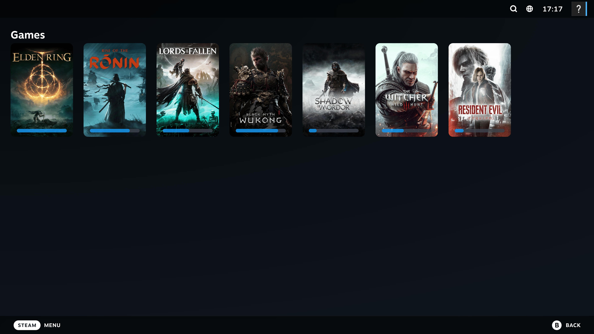
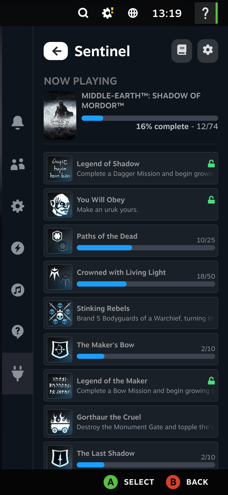
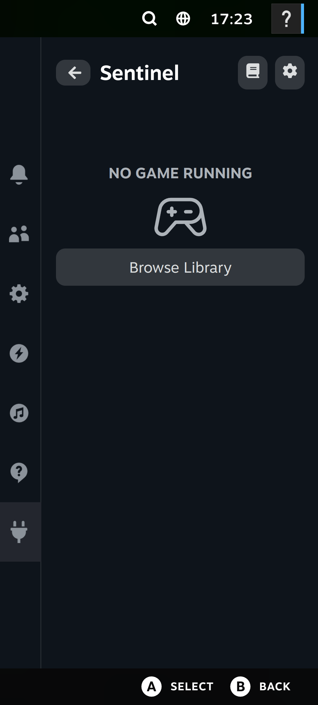
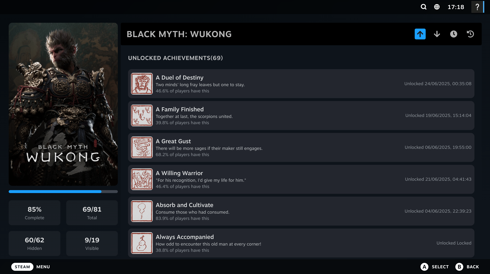
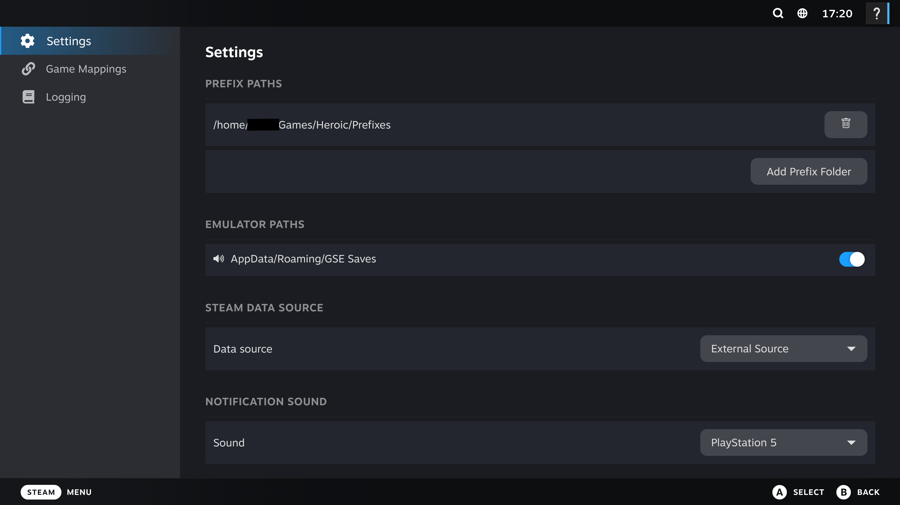
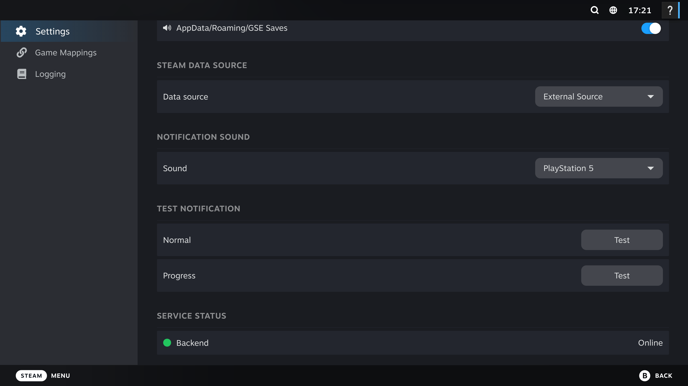

## Sentinel decky -  An Achievement Watcher for Linux
 



The beta release includes an additional plugin for decky-loader.

### Features
- Receive notification toasts for unlocked achievements and achievement stat updates for your Wine/Proton games supporting Goldberg Emulator forks
- View detected Sentinel games from Steam Deck Gaming Mode.
- See details for the currently running game.
- Browse achievement lists and completion status.
- See unlocked achievements and progress achievements.
- View a separate notification history list for the currently running game.
- Configure relevant Sentinel settings from the plugin.
- Use the same Sentinel config and data as the desktop app.

### Screenshots


#### No Game Running


#### Now Playing


#### Achievement Details


#### Settings


#### Additional Settings


### Install

1. Download the `sentinel-decky-plugin` from the GitHub release assets .
2. Run the following command assuming the zip is in Downloads folder
```bash 
sudo mkdir -p ~/homebrew/plugins/sentinel && sudo unzip -o ~/Downloads/sentinel-decky-plugin.zip -d "$_"
```
3. Restart Steam


### Beta Notes
- This plugin is beta software and may change between beta releases.
- Report Decky-specific issues

### Side Note
- The decky-plugin uses the same config as the Sentinel desktop app (v1.0.5+) for those who have it

### Known Issues
- When using Steam Big Picture on a non-gamescope session, notification toasts are not triggered.
- In some cases, "Now Playing" screen is not triggered in Steam Big Picture Mode in non-gamescope session

